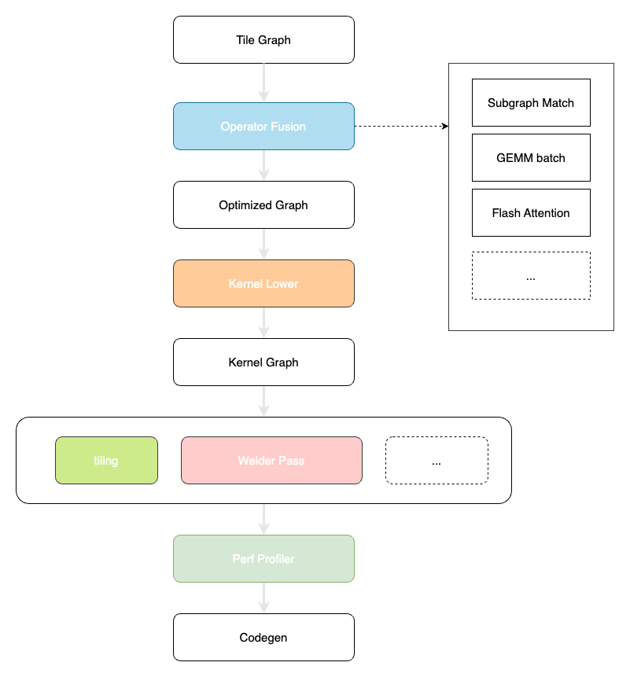

# TileGraph

TileGraph is an experimental DNN compiler that utilizes static code generation and kernel fusion techniques.

[设计文档](docs/design.md) | Design Docs

## Overview

## Reference Projects

- [InfiniTensor/Refactor](https://github.com/InfiniTensor/RefactorGraph): 分层解耦的深度学习推理引擎
- [microsoft/nnfusion](https://github.com/microsoft/nnfusion): A flexible and efficient deep neural network (DNN) compiler that generates high-performance executable from a DNN model description.

## Reference Papers

- BOLT: BRIDGING THE GAP BETWEEN AUTO-TUNERS AND HARDWARE-NATIVE PERFORMANCE(MLSys'22)
- Welder: Scheduling Deep Learning Memory Access via Tile-graph(OSDI'23)
- Graphene: An IR for Optimized Tensor Computations on GPUs(ASPLOS'23)
