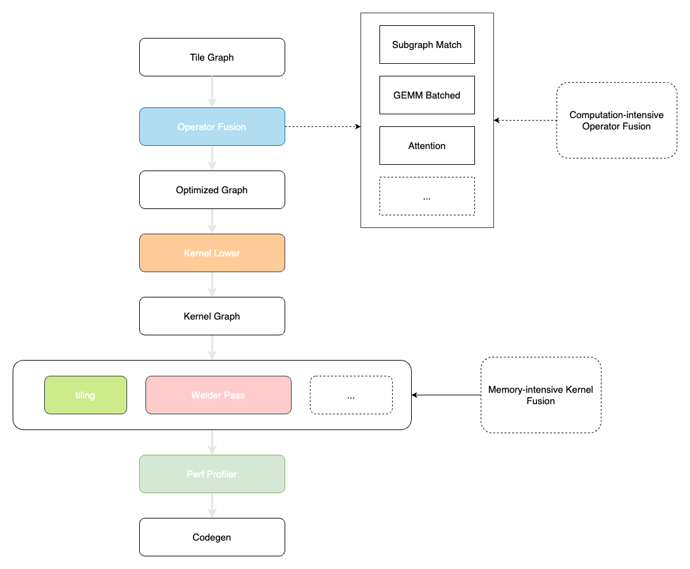

# TileGraph
TileGraph is an experimental DNN compiler that utilizes static code generation and kernel fusion techniques.

## Reference Projects
- [InfiniTensor/Refactor](https://github.com/InfiniTensor/RefactorGraph)
- [microsoft/nnfusion](https://github.com/microsoft/nnfusion)

## Reference Papers
- BOLT: BRIDGING THE GAP BETWEEN AUTO-TUNERS AND HARDWARE-NATIVE PERFORMANCE(MLSys'22)
- Welder: Scheduling Deep Learning Memory Access via Tile-graph(OSDI'23)
- Graphene: An IR for Optimized Tensor Computations on GPUs(ASPLOS'23)
